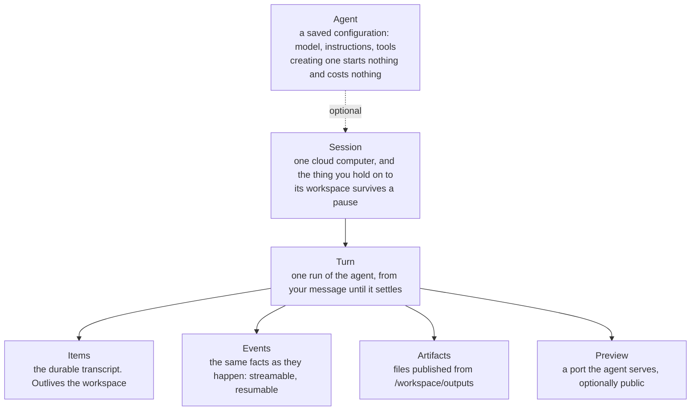
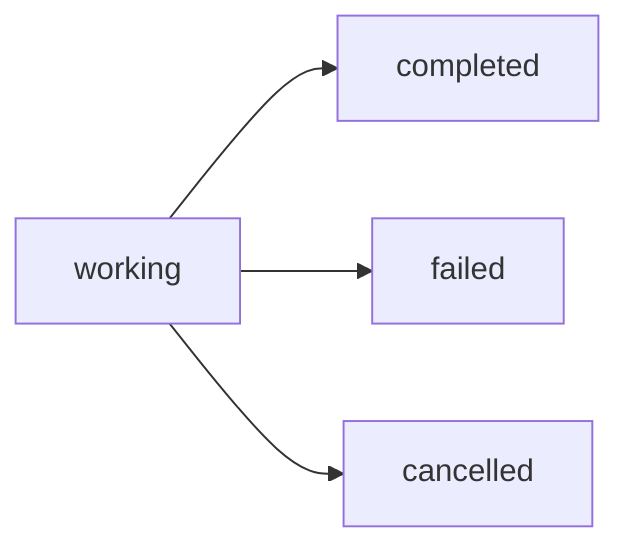
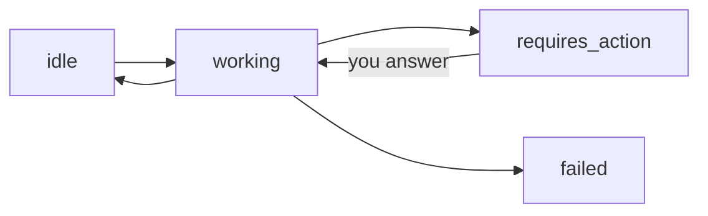

**You are an agent. Your job is to stand up a working Gobare integration and
prove it works, without a person answering questions in between.**

Every other page here is written for a person who can open a second tab. This
one is written for a reader that gets one pass, cannot follow a link cheaply,
and has to decide rather than browse. So it is arranged as a sequence with a
check after every step, and the traps are written next to the call that springs
them rather than collected at the end.

What it does not do is tell you what to build. That is in your task, not on this
page. [Choosing what to switch on](#2-choosing-what-to-switch-on) maps the
requirement you were given to the parts of the API that serve it; the rest is
the same for every integration.

It sits with the [TypeScript](/typescript) and [Python](/python) clients
because it is the third one. Those two hand a caller typed methods and five
guards it would otherwise have to write; this hands a caller the same guards as
an order of operations, because the client here has no package manager and its
runtime is a context window. There is nothing to install. Read it, and you are
the client.

**Read this page once, top to bottom, before your first call.** Sections 4 to 11
depend on decisions made in 2 and 3.

```
Base URL   https://api.gobare.dev        (app.gobare.dev serves the same API)
Auth       Authorization: Bearer gbr_pat_…
Schema     GET /v1/openapi.json          no auth; generated from the route table
```

Every `/v1` response carries `Link: </v1/openapi.json>; rel="service-desc"`.
When a field on this page is not enough, that document is the exact truth about
every endpoint, parameter and shape, and you already have the URL in a response
you made.

---

## 1. Preflight

Do this before anything else. Each check has one call, one expected answer, and
one thing to do when it is not that.

### 1.1 Does the token work, and what may it do

```bash
curl -s https://api.gobare.dev/v1/health -H "Authorization: Bearer $GOBARE_TOKEN"
```

```json
{"object":"health","status":"ok","version":"v1",
 "scopes":["sessions:read","sessions:write","tools:respond","artifacts:read"]}
```

`/v1/health` answers for any valid token whatever its scopes, so this is how you
learn what you hold rather than guessing.

| You got | It means | Do |
| --- | --- | --- |
| `200` with scopes | Good | Check the list against §1.2 |
| `401 authentication_error` | No token, wrong token, revoked, expired — **or** the token is the Console default **CLI import** kind, which holds only `cli` and is refused by every `/v1` route | Stop. Ask for a token of kind **Agent API · read/write**. Do not retry |
| `503 directory_unavailable` | Ours, not yours. A `Retry-After` header comes with it | Wait that long, retry. Do not report a credential problem |

A `401` also carries `WWW-Authenticate: Bearer realm="gobare"`. Treat `401` as
terminal: nothing about waiting makes a rejected token accepted.

### 1.2 Do you hold the scopes your plan needs

There are six: `sessions:read`, `sessions:write`, `tools:respond`,
`artifacts:read`, `credentials:write`, and `cli` — which is the Console's
default kind and is refused by every `/v1` route. Which endpoint needs which is
one table in
[production-integration.md](/production-integration), and it is the only copy
on purpose; each operation in `GET /v1/openapi.json` also carries its own.

What you have to decide here is not the mapping but the **combination**, and
there are three worth naming:

- **Drives sessions end to end** — read, write, respond and artifacts together.
  It still cannot connect a model provider; that needs `credentials:write`.
- **Only answers the agent's calls** — read plus `tools:respond`. It cannot send
  a message, cancel a turn or delete anything, which is what you want a fleet of
  tool handlers to hold.
- **Only watches and collects** — read plus `artifacts:read`, and it really is
  read-only: nothing it holds changes state, including deleting an artifact.

Ask for the narrowest one your §2 rows need. A call missing its scope is
`403 permission_denied` and the message names the scope it wanted, so a mistake
here costs one call, not an investigation.

### 1.3 Is there a model to run

```bash
curl -s https://api.gobare.dev/v1/model-credentials -H "Authorization: Bearer $GOBARE_TOKEN"
```

```json
{"object":"list","data":[
  {"object":"model_credential","id":"cred_8f2a91c4d7b0e6","label":"MiniMax",
   "connector":"minimax","model":"MiniMax-M3","is_default":true}]}
```

**Take `model` from here. Do not invent a model name.** Asking for one this
organization has not connected is refused by name.

An empty list means nothing can run yet. If you hold `credentials:write` you can
fix it yourself:

```bash
curl -s https://api.gobare.dev/v1/model-connectors     # no token needed; what this deployment supports
curl -s -X POST https://api.gobare.dev/v1/model-credentials \
  -H "Authorization: Bearer $GOBARE_TOKEN" -H 'content-type: application/json' \
  -d '{"key":"sk-ant-api03-…"}'
```

The key is verified against the provider before anything is stored, so a bad key
fails here rather than inside your first turn. If several vendors issue keys with
that prefix the refusal says so and lists them — send `provider` as well. Full
rules in [model-credentials.md](/model-credentials).

If you do not hold `credentials:write`, stop and say so. It is deliberately not
included in a session-creating token: a session spends sandbox minutes, a
provider key decides whose bill every future turn lands on.

### 1.4 The two preconditions that are not visible from here

Check these only if §2 says your plan needs them, and check them **before** you
build, because both fail late and confusingly:

- **A repository** needs the organization to have a GitHub connection. Without
  one, a session naming `environment.repo` is refused up front.
- **A public URL** needs the deployment to have a base domain. Without one,
  `POST /v1/sessions/{id}/preview` answers `not_found` saying so.

---

## 2. Choosing what to switch on

This is the only section that depends on your task. Read the requirement you were
given, find its rows, and switch on exactly those. Everything else stays off —
an unused capability is a thing that can fail.

| Your requirement | Switch on | The constraint that will bite |
| --- | --- | --- |
| The result is one or more files | Tell the agent to write under `/workspace/outputs`, then read `/artifacts` | Only that directory is published. Anything else dies with the workspace |
| The result is a page a person opens | Ask for a server and `preview(port)`, then publish — [preview.md](/preview) | `preview.url` is not for other people; `published_url` is, and it is null until you publish |
| The agent needs data only your system has | A `function` tool, answered with `input.tool_result` | Declaring and handling are two halves and both are required |
| The agent needs a third-party capability or knowledge base | An `mcp` server, by `url` or by `command` | `required: false` plus a broken address is the one combination with no signal anywhere |
| The agent needs the open internet | Built-in tools: `web_search`, `web_fetch`, `image_search`, `browse`, `browser_act`, `screenshot` | Naming any narrows the session to exactly those. `"tools": []` means no route out at all |
| A person must agree before it acts | `approval_mode: "per_step"`, or a `permission_rules` entry with `"decision": "ask"` | The pause arrives as a `required_action` of type `approval` — your code can answer it, or a person can in the Console |
| It must not change anything | `approval_mode: "read_only"` | It also refuses MCP tools whose server does not annotate them — see §5.3 |
| It should plan without doing | `approval_mode: "plan"` | |
| It works on your code | `environment.repo: "owner/name"` | A `201` does not mean the clone happened. Read `environment.repo.clone_error` |
| It needs input files you hold | `environment.files` at creation, `POST /files` afterwards | Seeded files never overwrite; live writes always do |
| It needs secrets | `environment.profiles` | Bind-only. Values are never returned and cannot be set through this API |
| You must find the session again after a restart | `metadata`, then `GET /v1/sessions?metadata=job:8842` | Values must be strings, and nothing is truncated or coerced |
| Every session in this part of your product starts the same | An [agent](/saved-agents): `POST /v1/agents`, then `{"agent":{"id":"…"}}` | It is copied, not referenced. Changing it never reaches work already running |
| The work spans hours and several rounds | One session, many turns | A workspace is reclaimed two hours after it starts. Pausing does not count against that |
| You want two attempts from one state | `POST /v1/sessions/{id}/fork` | Spends a session slot; refused with `conflict` mid-turn |
| Your process must not sit and wait | [webhooks.md](/webhooks) | Delivery is at least once, and can arrive out of order |
| A person is watching progress | The event stream, §7.1 | Build on persisted events; treat deltas as decoration |
| Your caller retries | `Idempotency-Key` on every write — [idempotency.md](/idempotency) | Scoped to (token, method, path, key). **Not** to the body |

Write down the rows you chose. §11 turns that list into the self-test you have
to pass before you are finished.

---

## 3. The five nouns, and the one state machine that matters



Ids are ours and opaque: sessions are UUIDs, turns are `turn_…`, artifacts are
`art_…`, subscriptions are `whsub_…`. Do not parse them. Times are milliseconds
since the epoch, as numbers.

### 3.1 The mistake that costs the most

**A turn has four statuses and no fifth one.**



`working` covers everything before it settles — **including a turn that is
parked, waiting for you to answer something**. There is no `waiting`. Polling
`turn.status` for a fifth value is an infinite loop that ends when the workspace
is reclaimed two hours later.

What changes when the agent needs you is the **session**:



So the rule is: **poll the session to learn that you are needed; poll the turn to
learn that the work is over.**

| Field | Read it to answer |
| --- | --- |
| `session.status` | Is something waiting on me? (`requires_action`) |
| `session.required_actions` | What exactly, and with which ids |
| `turn.status` | Is this piece of work over, and how |
| `turn.artifacts` | Can I fetch the files yet — see §8.1 |
| `environment.state` | Is the computer up: `unknown`, `running`, `paused`, `destroyed`, `recovering`, `recovery_failed` |

You do not have to wait for `environment.state: "running"` before sending work. A
message queues against a session in any state and the workspace comes up to
serve it.

---

## 4. Configure the session

One call, and everything is optional except having a model available.

```bash
curl -s -X POST https://api.gobare.dev/v1/sessions \
  -H "Authorization: Bearer $GOBARE_TOKEN" \
  -H 'content-type: application/json' \
  -H "Idempotency-Key: $(uuidgen)" \
  -d '{
    "agent": {
      "model": "MiniMax-M3",
      "instructions": "…",
      "approval_mode": "auto",
      "permission_rules": [{ "decision": "deny", "path": "/etc" }],
      "tools": []
    },
    "environment": { "repo": "acme/site", "files": [], "profiles": [] },
    "metadata": { "job": "8842" },
    "title": "…"
  }'
```

**Verify:** the reply is `201` and carries an `id`. Read it back with
`GET /v1/sessions/{id}` and confirm `agent.model`, `agent.approval_mode` and
`agent.permission_rules` are what you sent. Everything you can set, you can read
back, so nothing about what a session enforces is something you have to remember
having sent.

### 4.1 Field notes that are not guessable

- **`metadata` is your only durable handle.** Put your own job id there at
  creation. After a restart, `GET /v1/sessions?metadata=job:8842` finds the
  session and `?status=requires_action` finds everything owing you an answer —
  each listed session carries its own `required_actions`, so one call is enough.
- **`instructions` are not a permission system.** They shape behaviour; they do
  not constrain it. `approval_mode` and `permission_rules` constrain it. Where
  your instructions and the product's own rules disagree, the product's win.
- **`instructions` apply from the session's next workspace, not mid-turn.** A
  `PATCH` during a running turn is not ignored — it takes effect on the turn
  after.
- **An unknown field is refused, never ignored**, and the refusal names the
  nearest accepted field and lists the rest. `modelCredentialId` finds
  `model_credential_id`; `read-only` finds `read_only`. Take the suggestion, but
  read the list beside it — the suggestion travels with the full vocabulary
  precisely so a wrong guess is recoverable from one sentence.
- **`environment.branch` does not exist.** The clone reports which branch it
  landed on in `environment.repo.branch`; it cannot be told which to use.
- **`input` at creation is all or nothing.** A `201` means the session exists
  *and* the opening message was accepted. A non-2xx normally means nothing exists
  — except when the message failed *and* we could not clean up, in which case the
  error names the session id you now have to delete. Read the message.

### 4.2 What you can change afterwards

`PATCH /v1/sessions/{id}` takes `title`, `metadata`, and — **nested under
`agent`** — `instructions`, `approval_mode` and `permission_rules`:

```bash
curl -s -X PATCH https://api.gobare.dev/v1/sessions/$SESSION \
  -H "Authorization: Bearer $GOBARE_TOKEN" -H 'content-type: application/json' \
  -d '{"agent":{"approval_mode":"per_step"}}'
```

A flat `{"approval_mode":"per_step"}` is `invalid_request` naming the field. A
`PATCH` with no recognised field at all is also refused rather than accepted as a
no-op.

### 4.3 Reusing one configuration

If more than one session in your integration starts the same way, save it once:

```bash
curl -s -X POST https://api.gobare.dev/v1/agents \
  -H "Authorization: Bearer $GOBARE_TOKEN" -H 'content-type: application/json' \
  -d '{"name":"extractor","model":"MiniMax-M3","instructions":"…","tools":[]}'

curl -s -X POST https://api.gobare.dev/v1/sessions \
  -H "Authorization: Bearer $GOBARE_TOKEN" -H 'content-type: application/json' \
  -d '{"agent":{"id":"extractor"}}'
```

`name` is a slug you choose; posting the same name again replaces that agent in
place and keeps its id. A replacement really replaces — a field you leave out is
removed, not carried over.

Inline fields beat the agent, and how depends on the field: `model`,
`model_credential_id` and `instructions` override **per field**, so overriding the
model keeps the agent's instructions. `tools` and `text` are **replaced whole**,
never merged.

**Do not read an agent back and post it straight in again.** A read-back carries
`redacted`, naming the secrets withheld, and `redacted` is not a request field —
you get a `400` rather than a success that quietly blanked your credentials.
Build the body from your own source, or re-send the secrets. Full rules in
[saved-agents.md](/saved-agents).

---

## 5. Give it tools

```
PUT /v1/sessions/{session_id}/tools     replaces the whole configuration
GET /v1/sessions/{session_id}/tools     reads it back, secrets withheld
```

`PUT`, not `POST`: send the complete list every time. At most 32 entries, each
name 1–64 characters. You can pass the same list as `agent.tools` at creation.

```bash
curl -s -X PUT https://api.gobare.dev/v1/sessions/$SESSION/tools \
  -H "Authorization: Bearer $GOBARE_TOKEN" -H 'content-type: application/json' \
  -d '{"tools":[
        {"type":"web_search"},
        {"type":"function","name":"lookup_order",
         "description":"Fetch an order from the billing system by id.",
         "timeout_seconds":30,
         "parameters":{"type":"object","properties":{"order_id":{"type":"string"}},
                       "required":["order_id"],"additionalProperties":false}},
        {"type":"mcp","name":"docs","url":"https://mcp.example.com/mcp",
         "headers":{"x-api-key":"…"},"allowed_tools":["search"],"required":true}
      ]}'
```

**Verify:** `GET …/tools` returns the same vocabulary you sent — one `tools`
array, each entry carrying its `type`. Count it. A tool you believe you declared
and did not is the cause of an agent that "ignores" your function.

Everything else the agent can do — shell, reading and writing files, starting
services, publishing a preview, committing — is always present and is not
configured here. You are choosing what it can reach **outside** the workspace.

### 5.1 Function tools

The agent calls it; the turn parks; you answer. That loop is §7.

Two halves, both required: the declaration is what the *model* is told exists,
and your handler is what *your process* answers with. Declaring without a handler
parks the turn on a call nobody answers. Handling without a declaration means the
call never happens.

**Set `timeout_seconds` on every function in production.** The default is no
deadline at all: a process that dies mid-answer holds a workspace until its
two-hour cap with nothing anywhere saying so. Past the deadline the *call* fails
and the turn carries on — so guessing too short costs you one failed call, not a
lost turn. Accepted range is 1 to 7200.

### 5.2 MCP servers

Exactly one of `url` (a server the sandbox connects out to) or `command` (a
process started inside the sandbox, spoken to over stdio). The connection is made
from the sandbox, not from the control plane.

**Decide `required` deliberately.** With `required: false` — the default — a
server that will not connect is skipped, the agent silently has fewer tools, and
you get an `mcp_unavailable` item and an `mcp.unavailable` event. With
`required: true` the session refuses to run and the error names the server and
the reason. It arrives as `invalid_request` on the first call that needs the
workspace, deliberately not a retryable code: waiting will not make the server
reachable.

If a `command` server reads a file, **do not put that file in
`environment.files`.** Seeded files are written when the workspace comes up,
which can be after the MCP client has already tried to start the process. Pass
the program inline as an argument, or write it with `POST /files` and declare the
tool afterwards.

### 5.3 `read_only` refuses MCP tools that are not annotated

This is the interaction that looks like a broken model and is not.

`read_only` allows an MCP tool whose server declares `readOnlyHint` in
`tools/list`, and refuses one that does not — "no annotation" is not "harmless",
and an organization's private plugin has been reviewed by nobody. The obvious
shape, a read-only investigation against a read-only runbook server, therefore
fails unless the server annotates.

Two ways out, and a rule beats the mode in both directions:

```json
{ "agent": { "approval_mode": "read_only",
             "permission_rules": [{ "decision": "allow", "tool": "mcp_docs_*" }] } }
```

**A refusal is visible, and you should watch for it.** It arrives as
`approval.resolved` with `approved: false`, the tool's `name`, a `code` of
`denied_read_only` or `denied_by_rule`, and the sentence the agent was given.
Match on `code`; it is the difference between a tool the platform blocked and one
the model never tried.

---

## 6. Send work

All input goes to one endpoint, one event per request, and the answer is `202` —
the agent has the work, not the answer.

```
POST /v1/sessions/{session_id}/events
```

| Type | What it does | Refused when |
| --- | --- | --- |
| `input.message` | Says something. Starts a turn, or queues behind the running one | `queue_full` at five queued |
| `input.tool_result` | Answers a function the agent called | `not_found` if no such call is pending |
| `input.approval` | Allows or refuses something the agent asked to do | `invalid_request` without `call_id` and a boolean `approved` |
| `input.question_answer` | Answers a question the agent asked | `invalid_request` without `call_id` and a non-empty `answer` |
| `input.steer` | Changes course mid-turn | `conflict` when no turn is running |
| `input.cancel` | Stops the running turn | Never — accepted even when nothing is running |

Full field lists are in [input.md](/input).

```bash
curl -s -X POST https://api.gobare.dev/v1/sessions/$SESSION/events \
  -H "Authorization: Bearer $GOBARE_TOKEN" -H 'content-type: application/json' \
  -H "Idempotency-Key: $(uuidgen)" \
  -d '{"events":[{"type":"input.message","content":"…"}]}'
```

```json
{"object":"input.accepted","type":"input.message","queued":false,"queue_position":null}
```

### 6.1 Finding the turn your message produced

The reply carries no `turn_id`, because when it is written there is no turn yet.
If you stream or take a webhook, the id arrives with them. **If you poll, this is
a trap with a specific shape:**

```bash
curl -s ".../turns?limit=1"   # on a session that has run before, this is the
                              # PREVIOUS turn — already completed, so your wait
                              # ends immediately on somebody else's result
```

Remember the latest turn id **before** you send, then wait for one that differs.
A fresh session has no previous turn and needs none of this.

### 6.2 Queueing is not steering

A message sent while a turn is running is accepted and **queued** — the reply
says `"queued": true` with a position. To change what a running turn is doing you
must say so by name with `input.steer`, which is a `conflict` when nothing is
running rather than quietly becoming a new turn.

Five queued messages per session is the ceiling; past it, `queue_full`.

---

## 7. Watch, and answer what it asks

Pick exactly one primary mechanism. Mixing them is fine, but one of them owns the
decision "is this done".

| Mechanism | Choose it when | Cost |
| --- | --- | --- |
| Webhooks | Your process should not sit and wait | Needs a public https endpoint |
| Event stream (SSE) | Something is rendering progress | An open connection, capped at 5 per token and 20 per organization |
| Polling | Simplest, and perfectly reasonable | Requests, which are rate limited |

### 7.1 The event stream

```bash
curl -N "https://api.gobare.dev/v1/sessions/$SESSION/events?last_event_id=4812" \
  -H "Authorization: Bearer $GOBARE_TOKEN"
```

`GET /v1/events` is the same thing for every session the organization owns.

- **Subscribe before you send.** The other order loses the opening frames
  whenever the agent starts quickly, which is to say intermittently and never on
  your machine.
- **Only persisted events carry an `id:` line.** Reconnect with
  `Last-Event-ID: <seq>` and you get everything persisted after that point, then
  live frames. Transient events — `agent.text`, `agent.thinking`, progress —
  carry `seq: null`, are not replayed, and are decoration. Build on the persisted
  ones.
- **No cursor and `0` are different requests.** No cursor is live frames only,
  which is what "subscribe first, then send" wants. `0` is everything, because
  zero is a real cursor.
- **Honour the `retry:` hint** rather than reconnecting instantly. It is
  deliberately longer than the time it takes us to notice your last connection
  went away, so a client following it is not racing us for its own stream slot.
- A `: ping` comment every 15 seconds keeps the connection open. Ignore it.

The persisted vocabulary is an allowlist: `turn.started`, `turn.ended`,
`agent.message`, `agent.tool_call`, `agent.tool_result`, `agent.compaction`,
`agent.error`, `agent.todos`, `user.message`, `message.queued`,
`message.dequeued`, `file.changed`, `approval.requested`, `approval.resolved`,
`question.asked`, `question.answered`, `tool.required`, `tool.resolved`,
`mcp.unavailable`, `sandbox.created`, `sandbox.paused`, `sandbox.resumed`,
`preview.ready`, `workspace.recovery_failed`, `artifact.created`.

`turn.ended` is deliberately neutral: the run finished, and whether it succeeded
is a property of the turn it names. Read the turn.

### 7.2 Webhooks

```bash
curl -s -X POST https://api.gobare.dev/v1/webhooks \
  -H "Authorization: Bearer $GOBARE_TOKEN" -H 'content-type: application/json' \
  -d '{"url":"https://you.example.com/hooks","events":["turn.completed","turn.failed"]}'
```

Seven event types: `session.created`, `session.action_required`,
`session.working`, `session.idle`, `session.failed`, `turn.completed`,
`turn.failed`.

**The secret comes back once.** Store it from this response; it is never shown
again.

Verification is `HMAC-SHA256(secret, "{timestamp}.{body}")`, hex, compared
against `x-gobare-signature`. Three rules, and each has a failure that looks like
something else:

1. **Verify the raw body**, before any parse and re-serialise. A round trip
   changes key order and will not match.
2. **`x-gobare-timestamp` is milliseconds**, the same units as `Date.now()`.
   Dividing by 1000 rejects every delivery and fails looking exactly like a bad
   signature.
3. **Reject a timestamp far from your clock** — a few minutes is reasonable.

`data` names the object; it never embeds it. Read the object afterwards and you
see current truth. Delivery is at least once and can arrive out of order, so make
the handler idempotent. Answer inside 10 seconds and do the work afterwards.

Subscribing the same URL to exactly the same event set twice is `409 conflict`
naming the subscription already doing it — a duplicate buys you every delivery
twice, permanently. More in [webhooks.md](/webhooks).

### 7.3 Answering a required action

When the session reports `requires_action`, read `required_actions`. Every entry
carries `type`, `turn_id`, `call_id`, and `expires_at` (or null).

```json
{"type":"function_call","turn_id":"turn_9d41…","call_id":"call_9a1f…",
 "name":"lookup_order","arguments":{"order_id":"A-4471"},"expires_at":null}
```

**All three types are answerable through this API.** Branch on `type`:

| `type` | Answer with | Body |
| --- | --- | --- |
| `function_call` | `input.tool_result` | `turn_id`, `call_id`, `success`, then `output` (a string) or `error` |
| `approval` | `input.approval` | `call_id`, `approved` (a boolean) |
| `question` | `input.question_answer` | `call_id`, `answer` (a non-empty string) |

`approval` and `question` can also be resolved by a person in the Console, which
is often what you want. What matters is that an API-only integration is not stuck
waiting for one.

```bash
curl -s -X POST https://api.gobare.dev/v1/sessions/$SESSION/events \
  -H "Authorization: Bearer $GOBARE_TOKEN" -H 'content-type: application/json' \
  -d '{"events":[{"type":"input.tool_result","turn_id":"'$TURN'","call_id":"'$CALL'",
       "success":true,"output":"{\"status\":\"shipped\"}"}]}'
```

**`output` must be a string.** Serialise it yourself; nothing will guess whether
your object was meant as JSON text.

**Never put a thrown exception's message in `error`.** It goes into the model's
context, and a stack trace is an efficient way to put your database host in a
prompt. Send a fixed string and log the real one.

The reply's `outcome` is the thing to branch on:

| `outcome` | Do |
| --- | --- |
| `accepted` | Nothing. The turn is resuming |
| `already_resolved` | Nothing. You answered twice, which at-least-once delivery makes legitimate |
| `not_delivered` | **Act.** See below |
| `unknown` (`404`) | Your `turn_id`/`call_id` are wrong, or the call expired. Copy both verbatim from `required_actions` |

**`not_delivered` is the one that needs handling rather than logging.** The
sandbox was not holding that call when your answer arrived — usually because it
was restarted underneath the turn. Nothing fails, nothing times out: the session
goes back to reading `working` with an empty `required_actions`, which is
indistinguishable from healthy on every surface including webhooks. Treat it as
"this turn lost my answer": start a fresh turn with the same information, or fail
the job and say why. **Do not wait.**

---

## 8. Collect the result

### 8.1 Artifacts

Anything written under `/workspace/outputs` is published when the turn settles,
and outlives the workspace. **`status: "completed"` is not yet a promise that the
artifact list is filled in** — publication runs after the turn settles so that a
storage problem can never delay your work.

Wait on `turn.artifacts`, not on `turn.status`:

| `turn.artifacts` | Means |
| --- | --- |
| `null` | The turn has not settled |
| `pending` | Settled; publication still running. An empty list means *not yet* |
| `ready` | Finished. An empty list means the turn produced nothing |
| `partial` | Finished, and left something behind. `artifacts_skipped` names each file and why |
| `failed` | Publication could not run. Quote the turn id when reporting it |

With webhooks you can skip this: `turn.completed` is sent once publication has
settled. If it has not settled after 30 seconds the notification is sent anyway
with the turn still reading `pending`, so read the field rather than assuming.

```bash
curl -s ".../v1/sessions/$SESSION/artifacts"                          # list
curl -s ".../v1/sessions/$SESSION/artifacts/$ARTIFACT/content" -o out  # bytes
curl -s ".../v1/sessions/$SESSION/artifacts/archive?turn_id=$TURN" | tar -x -C ./out
```

The archive is a streamed tar. With `?turn_id=` the entries carry the workspace's
own paths; without it you get the whole session and each entry is prefixed with
the turn that published it, because two turns writing `report.md` are two files
and a flat archive would extract as one.

### 8.2 The workspace itself

Artifacts only ever cover `/workspace/outputs`. To answer "the agent said it
wrote that — did it?", read the workspace:

```bash
curl -s ".../v1/sessions/$SESSION/files"                       # no query parameters
curl -s ".../v1/sessions/$SESSION/files/content?path=src/app.ts"
curl -s -X POST ".../v1/sessions/$SESSION/files/refresh"       # needs sessions:write
```

**A read is of the last snapshot, not the live sandbox.** `captured_at` says
which moment; `state: "missing"` means none has been taken, which is not the same
as an empty workspace. `refresh` takes a fresh one — a separate call, and a write
scope, because it wakes a paused sandbox.

`GET /files` reads **no query parameters at all**. Sending `?limit=` is a `400`
rather than a silent success, which is the general rule: an ignored filter hands
back everything looking exactly like a filter that matched everything.

### 8.3 The transcript

`GET /v1/sessions/{id}/items` is the durable record and it outlives the
workspace. Item types: `message`, `tool_call`, `command_execution`,
`file_change`, `approval`, `question`, `mcp_unavailable`, `error`.

**`error` is the one to look for when a session says `failed` and there are no
turns at all.** A run that could not start leaves no turn behind; this item says
why, in `detail.message`. A seeded file that could not be written appears here
too.

### 8.4 Publishing what it built

Publishing needs the agent to have started a server and called `preview(port)` —
ask for it in the same sentence as the work. `preview.port` on the session is the
signal that there is something to publish; until it is set, publishing is refused
rather than answered with an address that returns errors.

```bash
curl -s -X POST ".../v1/sessions/$SESSION/preview" \
  -H "Authorization: Bearer $GOBARE_TOKEN" -H 'content-type: application/json' -d '{}'
```

Omit `subdomain` and one is derived from the session id, which is what you want
when the address is for a machine rather than a person. Publishing twice to the
same address answers `200` with the same URL; unpublishing twice answers `200`
too. Both are retry-safe on purpose. Details and every refusal in
[preview.md](/preview).

A published address is a stable route, not a permanently running computer: an
idle workspace is still paused, and the first public request wakes it. A visitor
waits a few seconds and then sees the site.

---

## 9. Rules you must not break

Each one prevents a *plausible* wrong outcome rather than an error. That is why
they are worth the lines.

1. **Poll the session for `requires_action`; poll the turn for completion.**
   There is no `waiting` turn status. (§3.1)
2. **Remember the previous turn id before you send**, or you will read the
   previous turn's result. (§6.1)
3. **Subscribe before you send.** (§7.1)
4. **Wait for `turn.artifacts`, not `turn.status`.** (§8.1)
5. **Branch on `error.code`, never on the HTTP status.** Three codes share
   `429` and one of them never clears. (§10)
6. **Honour `Retry-After`, and give up when there is none.** Its absence is the
   signal, not an omission. (§10)
7. **`output` in a tool result is a string, and never a thrown exception's
   message.** (§7.3)
8. **`PUT /tools` replaces**, and a read-back cannot be posted straight in —
   `redacted` is refused. (§5)
9. **If nothing in your integration can answer a question, tell the agent not to
   ask one.** One line in `instructions`: *"Never ask the user a clarifying
   question: if something is ambiguous, state your assumption and continue."*
   Otherwise it parks on a `question` and waits. (§7.3)
10. **Delete every session you create.** Twenty-five concurrent per
    organization, a fork spends one too, and a paused sandbox still holds its
    slot. (§10.2)
11. **Send `Idempotency-Key` on every write**, and a fresh one per logical
    operation. It is not scoped to the body: reusing a key with different content
    replays the first answer rather than doing the second thing. (§6)
12. **Never put a `gbr_pat_` token in browser JavaScript.** There is no CORS on
    `/v1`, deliberately; call it from your backend.

---

## 10. When something is refused

Every failure has one shape:

```json
{"error":{"code":"permission_denied",
          "message":"This token does not have the \"sessions:read\" scope.",
          "request_id":"859ae087"}}
```

`request_id` is also on `x-request-id`, on **every** response including the
successful ones. Log it next to whatever you record about the call.

### 10.1 Code to action

| Code | Status | Do |
| --- | --- | --- |
| `invalid_request` | 400 | Fix the request. The message names the field and, for a near-miss, the field you probably meant |
| `context_length_exceeded` | 400 | The conversation is too long for the model. Start a new session, or summarise |
| `authentication_error` | 401 | Terminal. Get a different token |
| `permission_denied` | 403 | Terminal. The message names the missing scope |
| `not_found` | 404 | Wrong id, or no such endpoint. Do not retry |
| `method_not_allowed` | 405 | The `Allow` header lists the verbs that exist |
| `conflict` | 409 | The session is not in a state that allows this. Usually `input.steer` with nothing running, or a fork mid-turn |
| `queue_full` | 429 | This session holds five queued messages. Wait for it to drain, or use another session |
| `rate_limit_exceeded` | 429 | Wait exactly `Retry-After`, then retry. Hammering does not shorten it |
| `project_limit_exceeded` | 429 | **Retrying never succeeds.** Delete a session |
| `internal_error` | 500 | Retry. Report it with the `request_id` |
| `sandbox_error` | 500 | Retry |
| `workspace_recovery_failed` | 500 | Do not retry. The session needs attention |
| `bridge_incompatible` | 500 | The sandbox predates a capability you asked for. Create a new session |
| `provider_error` | 502 | Your model provider failed. Retry |
| `provider_unauthorized` | 502 | Do not retry. The model credential is rejected — fix it |
| `sandbox_unavailable` | 503 | Retry |
| `directory_unavailable` | 503 | Ours. Retry |

Everything marked retryable carries `Retry-After`; the rest carry none. **A
client that honours the header and gives up without one is doing the right thing
on every row above without knowing any of them.**

The three `429`s are the reason rule 5 exists: a client that retries all of them
identically spins forever on `project_limit_exceeded`.

If you have a symptom rather than a code, [troubleshooting.md](/troubleshooting)
is indexed by what you are looking at; the full table with statuses is
[errors.md](/errors).

### 10.2 Budget, and the ledger you must keep

Pace yourself from the headers rather than discovering the wall. Every
authenticated response carries them:

```
x-ratelimit-limit: 120      x-ratelimit-remaining: 117
x-ratelimit-reset: 2        x-ratelimit-resource: general
```

`resource` names **which** bucket: `sessions` (10 per minute, for
`POST /v1/sessions`) or `general` (120 per minute, everything else). The same
token legitimately holds 9 of one and 119 of the other at once, so without the
name one of those numbers reads as a bug.

The ceilings you are most likely to meet:

| | |
| --- | --- |
| Concurrent sessions per organization | 25 — a fork spends one, a paused sandbox still holds one |
| Queued messages per session | 5 |
| Open event streams | 5 per token, 20 per organization |
| Workspace lifetime | reclaimed 2 hours after it starts; paused after 5 idle minutes |
| Tools per session | 32 |
| Request body | 1 MiB, except `POST /v1/sessions` at 16 MiB |

Every number, including the ones not here, is in [limits.md](/limits).

**Keep a ledger.** Before you finish, every one of these must be accounted for:

```
sessions created      → deleted, or handed over with their ids
forks created         → the same; a fork is a session
agents created        → deleted if they were scaffolding
webhook subscriptions → deleted if they were scaffolding
published previews    → unpublished if they were scaffolding
```

An integration that creates and never deletes stops being able to create, and the
failure arrives as `project_limit_exceeded` on somebody else's work.

---

## 11. Prove it, then stop

**Do not report the integration as working until this passes.** Run the rows you
chose in §2 and nothing else; a check you skipped is not a check that passed.

| # | Assert | Against |
| --- | --- | --- |
| 1 | `GET /v1/health` returns exactly the scopes your plan needs | §1.2 |
| 2 | The model you name is one `GET /v1/model-credentials` lists | §1.3 |
| 3 | A created session reads back with the `approval_mode`, `permission_rules` and `instructions` you sent | §4 |
| 4 | Sending the same `Idempotency-Key` twice yields one session, not two | §6 |
| 5 | `GET …/tools` returns every tool you declared, and the same count | §5 |
| 6 | A turn runs to `completed` | §3.1 |
| 7 | *If you declared a function:* the session reached `requires_action`, and your answer came back `accepted` | §7.3 |
| 8 | *If you declared an MCP server:* no `mcp_unavailable` item, and no `approval.resolved` with `denied_read_only` | §5.2, §5.3 |
| 9 | *If you restricted it:* zero `file_change` items in a `read_only` session | §2 |
| 10 | *If you expect files:* `turn.artifacts` reached `ready` and the paths you asked for are listed | §8.1 |
| 11 | *If you subscribed:* a delivery arrived and its HMAC verified over the raw body | §7.2 |
| 12 | *If you published:* an unauthenticated `GET` of `published_url` returns your content | §8.4 |
| 13 | Every resource in your §10.2 ledger is deleted or deliberately handed over | §10.2 |

Two rules about reporting:

- **A check that cannot pass is a result, not a reason to narrow the scope.** Say
  which one, what you saw, and what you think it means. Quote the `request_id`.
- **Distinguish "the API refused me" from "my request was wrong".** The refusal
  message names the field, the scope or the ceiling. If it named one, it was
  yours.

---

## 12. Where the truth is

This page is a build order. When you need a field rather than a sequence:

| | |
| --- | --- |
| `GET /v1/openapi.json` | Every endpoint, parameter and shape. Generated from the route table the server matches against, so it cannot describe an endpoint that does not exist. The URL is on every response as `Link: …; rel="service-desc"` |
| [objects.md](/objects) · [reference.md](/api-reference/check-the-access-token) | The same, rendered |
| [sessions.md](/sessions) | Every session field, in full |
| [input.md](/input) | Every field of the six input events |
| [tools.md](/tools) | Every tool field, and every refusal |
| [required-actions.md](/required-actions) | The answering loop, deadlines, and what each outcome means |
| [events.md](/events) | The event vocabulary and resumption |
| [webhooks.md](/webhooks) | Subscriptions, signing, retries |
| [preview.md](/preview) | Publishing, waking, unpublishing |
| [saved-agents.md](/saved-agents) | Saved configurations and how overrides resolve |
| [pagination.md](/pagination) | Paging, and the two filters on `GET /v1/sessions` |
| [idempotency.md](/idempotency) | What a key covers, and what it does not |
| [limits.md](/limits) | Every ceiling with its number |
| [errors.md](/errors) | Every code with its status |
| [troubleshooting.md](/troubleshooting) | Indexed by symptom |
| [model-credentials.md](/model-credentials) | Connecting a provider without a browser |
| [production-integration.md](/production-integration) | The same ground for a human colleague, with a copyable loop |

If this page and the OpenAPI document disagree, the OpenAPI document is right and
this page has a bug. Say so in your report.
