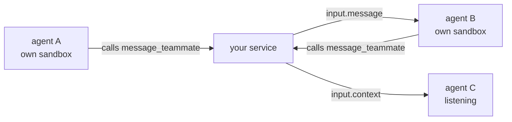

Several agents, one task, and they need to pass work between them. A researcher
finds something, a coder builds it, a reviewer reads it — and the person who
asked can interrupt any of them mid-sentence.

Two facts shape the whole design, and neither is negotiable:

**Each agent has its own machine.** That is the point — one agent installing a
dependency cannot break another's build. It also means an agent cannot simply
leave a note where a teammate will find it.

**An agent cannot call this API.** Nothing inside a sandbox holds a token, on
purpose: a credential there could create sessions and read every session in the
organization. So an agent's only way out is a tool call, which arrives at *your*
code.

Put together: **your service is the switchboard.** Every message between agents
passes through it, which is also what lets you decide who should speak next —
routing is your product, not ours.



## Before you start

A token and a model, as in the [quickstart](/quickstart).

## One crew, one tree

Give each agent a session, and point the rest at the first one:

```bash
ROOT=$(curl -s -X POST $GOBARE_API/v1/sessions \
  -H "Authorization: Bearer $GOBARE_TOKEN" -H 'content-type: application/json' \
  -d '{"title":"researcher","agent":{"instructions":"You research. You do not write code."}}' | jq -r .id)

curl -s -X POST $GOBARE_API/v1/sessions \
  -H "Authorization: Bearer $GOBARE_TOKEN" -H 'content-type: application/json' \
  -d "{\"title\":\"coder\",\"parent_session_id\":\"$ROOT\"}"
```

Now `?root=$ROOT` means "this crew" everywhere — see [Crews](/sessions#crews).
You do not have to keep your own membership list, and you do not have to invent
a `metadata` convention that will collide with someone else's.

## Give them a way to reach each other

A teammate is a function the agent can call. You answer it.

```bash
curl -s -X PUT $GOBARE_API/v1/sessions/$ROOT/tools \
  -H "Authorization: Bearer $GOBARE_TOKEN" -H 'content-type: application/json' \
  -d '{
    "tools": [{
      "type": "function",
      "name": "message_teammate",
      "description": "Send a message to a teammate. Returns as soon as it is delivered; they reply in their own time.",
      "parameters": {
        "type": "object",
        "properties": { "to": {"type": "string"}, "text": {"type": "string"} },
        "required": ["to", "text"]
      }
    }]
  }'
```

Declare it on every session in the crew. What the names mean — who `"coder"` is
— is yours to decide; the agent only sees the description.

## The switchboard

One stream carries the whole crew, and nothing else in your organization:

```ts
const stream = await fetch(`${API}/v1/events?root=${ROOT}`, { headers });

for await (const event of frames(stream)) {
  if (event.type !== "session.action_required") continue;

  const session = await get(`/v1/sessions/${event.session_id}`);
  for (const action of session.required_actions) {
    if (action.name !== "message_teammate") continue;
    const { to, text } = action.arguments;

    // Answer first. The sender carries on immediately — a handoff is a message,
    // not a blocking call, and a sender waiting on a teammate's whole turn is
    // the slowest possible way to build this.
    await post(`/v1/sessions/${event.session_id}/events`, {
      events: [{
        type: "input.tool_result",
        turn_id: action.turn_id, call_id: action.call_id,
        success: true, output: "delivered",
      }],
    });

    // Then wake the teammate.
    await post(`/v1/sessions/${crew[to]}/events`, {
      events: [{ type: "input.message", content: [{ type: "input_text", text }] }],
    });
  }
}
```

That is the whole handoff. The reply comes back the same way, because the
teammate has the same tool.

## Let the others listen without paying for it

When the person types into the room, only one agent should answer — but the
others still have to know what was said, or the next handoff arrives without
context.

`input.message` cannot do this: it always starts a turn. Three agents would mean
three turns per sentence, two of them producing nothing. Use `input.context`:

```ts
// the one being addressed — this starts a turn
await post(`/v1/sessions/${crew.researcher}/events`, {
  events: [{ type: "input.message", content: [{ type: "input_text", text: said }] }],
});

// everyone else — they will have read it, and no turn runs
for (const other of listeners) {
  await post(`/v1/sessions/${other}/events`, {
    events: [{ type: "input.context", content: [{ type: "input_text", text: `The user said: ${said}` }] }],
  });
}
```

If that agent is mid-turn, the context lands after it finishes. The running
turn's context is already fixed, and inserting into it would make one turn's
behaviour depend on when a message happened to arrive.

Without this the only way to keep the others current is to hold your own copy of
the conversation and resend it with every handoff — which makes each prompt grow
with the length of the room.

## Interrupting

A person changing their mind mid-turn is not a new message at the back of the
queue:

```ts
await post(`/v1/sessions/${busy}/events`, {
  events: [{ type: "input.steer", content: [{ type: "input_text", text: "Python, not TypeScript" }] }],
});
```

`input.steer` redirects the turn in flight. `input.cancel` stops it — and does
not undo what it already did, which is worth saying to the person before they
press it.

## Passing work, not just words

Text is enough for "have a look at this". For output, agents are on separate
machines, so a file moves through you:

```ts
const arts = await get(`/v1/sessions/${from}/artifacts`);
const body = await raw(`/v1/sessions/${from}/artifacts/${arts.data[0].id}/content`);
await post(`/v1/sessions/${to}/files`, { files: [{ type: "file", path: "/workspace/in/report.md", data: body }] });
```

Slower than a shared disk, and the reason to prefer it is the same reason the
sandboxes are separate: what crosses between agents is exactly what you moved.

## What it cost

```bash
curl -s "$GOBARE_API/v1/sessions/$ROOT/usage?root=$ROOT" -H "Authorization: Bearer $GOBARE_TOKEN"
```

Four numbers rather than one, because a live estimate is not a bill — see
[What a crew cost](/sessions#what-a-crew-cost).

## What this API does not do

**It does not decide who speaks next.** No `@` syntax, no built-in router. That
is a product decision and it belongs in your switchboard, where you can log it,
change it, and explain it to a user.

**It does not stop two agents editing the same file.** They are on separate
machines, so they cannot — but two agents given the same job will still do it
twice. Name one owner per piece of work.

**It will not scale past your session ceiling.** A coordinator and three workers
are four sessions. Check `GET /v1/sessions` against [limits](/limits) before you
fan out wide.

## Next

- [Crews](/sessions#crews) — the tree, and `?root=` everywhere
- [Tools](/tools) — what a function call can carry
- [Required actions](/required-actions) — the loop the switchboard runs on
