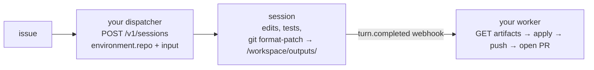

**The shape:** an issue goes in, a pull request comes out. The session clones
your repository, works on its own branch, and the change reaches GitHub.

The one decision worth making deliberately is **who pushes**. Both answers
work. They fail differently, and the difference is not obvious until you are
an hour into a run.

This guide was written by running it end to end against a private repository
on production. The permissions, the timings and the leak in it are from that
run.

## What the GitHub App can do

Connect GitHub once per organization in the Console. Every clone then mints a
fresh installation token. Ask GitHub what that token may do rather than
assuming:

```
contents        write     → clone, commit, push
pull_requests   write     → open the PR
metadata        read
(no issues permission)    → cannot read the issue it is fixing
repository_selection: all
expires_at: exactly 1 hour after minting
```

Two of these decide your architecture.

**There is no `issues` permission.** `GET /repos/{o}/{r}/issues` answers
`403` with an installation token. The agent cannot read the issue it was
asked to fix. Either your dispatcher reads it and puts it in `input`, or you
attach a GitHub MCP server with a separate PAT — see
[Give an agent your tracker](/guides/give-an-agent-your-tracker) for that
shape. The first needs no extra credential; prefer it unless the agent
genuinely needs comments and linked PRs.

**The token lives one hour, and is minted once, immediately before the
clone.** It is not refreshed mid-session. A session that works for ninety
minutes and then pushes finds a dead token — and it finds it at the last
step, after all the work is done. That is the worst possible moment to
discover a credential problem.

## Two architectures

### A — the agent produces a patch, your worker pushes



No write credential inside the sandbox. No expiry window — your worker
pushes with its own long-lived credential whenever it likes. One pusher,
which you can serialise per repository, which is the entire answer to write
races between parallel sessions.

### B — the agent pushes and opens the PR itself

The clone URL is `https://x-access-token:<token>@github.com/owner/repo.git`,
and git writes it into `.git/config`. So `git push` works from inside the
sandbox, and the same token has `pull_requests: write`, so the agent can open
the PR with one API call. No extra credential at all.

Fewer moving parts, and the run behind this guide used it successfully. It
also puts a write-capable credential inside the workspace — see the leak
below.

**Choose A for anything long-running or unattended.** Choose B when you want
the smallest possible pipeline and your sessions finish well inside the
hour.

## Create the session

```bash
curl -s -X POST $GOBARE_API/v1/sessions \
  -H "Authorization: Bearer $GOBARE_TOKEN" \
  -H "content-type: application/json" \
  -H "Idempotency-Key: issue-$NUMBER" \
  -d '{
    "title": "'"$REPO"' #'"$NUMBER"'",
    "metadata": { "issue": "'"$NUMBER"'", "branch": "agent/issue-'"$NUMBER"'" },
    "environment": { "repo": "'"$REPO"'" },
    "agent": { "instructions": "..." },
    "input": "GitHub issue #'"$NUMBER"' in '"$REPO"'\n\nBranch to use: agent/issue-'"$NUMBER"'\n\n<title and body, read by your dispatcher>"
  }'
```

`environment.repo` takes `owner/name` — not a URL. **Do not send
`environment.branch`**: it is refused. The branch is *reported* by the clone,
not chosen by you; the agent creates its working branch from the default
one, per your instructions.

Put the branch name in `metadata` as well as in the message. That is how your
`turn.completed` handler knows which branch to look at without parsing
prose.

### Instructions that produced a correct PR

```
You fix one GitHub issue per session, end to end, and you open the pull request yourself.

The repository is already cloned into /workspace. Work there.

1. Read the code before changing it. Do not assume file contents from the issue text.
2. Create a branch from the default branch, named agent/issue-N. Never commit to the default branch.
3. Make the change. Keep it to what the issue asks for.
4. Verify: every file you touched must still parse, and run the issue's own
   verification steps.
5. Commit with a message naming the issue.
6. Push: git push -u origin HEAD
7. Open the pull request with the GitHub REST API. The token is in the clone URL
   inside .git/config. POST to https://api.github.com/repos/OWNER/REPO/pulls with
   title, head, base and body. Put "Closes #N" in the body.
8. Report the pull request number and URL.

Never print the credential you extracted, and never write it into a file, a
commit or the pull request body.
```

Line 1 and line 4 are the load-bearing ones. "Read the code before changing
it" stops an agent from patching a file the issue described rather than the
file that exists. Naming the verification explicitly is what lets you check
whether it actually ran — see below.

## Expect a review round, and use it

In the run behind this guide the first push did four of five things
correctly and missed one: two tracked JSON files still contained the value
the issue asked to remove. The agent's own summary said the work was done.

The issue had stated its verification as a command. Running that command is
what found the miss — not reading the diff, and certainly not reading the
summary.

Sending the miss back took one message and 45 seconds:

```bash
curl -s -X POST $GOBARE_API/v1/sessions/$SID/events \
  -H "Authorization: Bearer $GOBARE_TOKEN" -H "content-type: application/json" \
  -H "Idempotency-Key: review-1" \
  -d '{"events":[{"type":"input.message","content":[{"type":"input_text",
       "text":"Review feedback. Files X and Y still contain Z. Fix them, then re-run the verification you were given and report its actual output rather than asserting it passed. Push to the same branch."}]}]}'
```

The branch updates, the PR updates with it. This is the normal shape of the
workflow, not an exception — write your dispatcher expecting at least one
round.

"Report its actual output rather than asserting it passed" is there because
the first summary asserted success. Asking for the output makes the claim
checkable.

## Verify the PR, not the report

```bash
gh pr view $PR -R $REPO --json state,headRefName,author,additions,changedFiles
git fetch origin agent/issue-$NUMBER && git checkout FETCH_HEAD
# then run the issue's verification yourself
```

The PR author will be `app/<your-app-slug>` when the agent opened it. That is
a useful property: PRs opened by the agent are distinguishable from PRs
opened by humans, in the GitHub UI and in filters, without any convention you
have to maintain.

## The leak you need to know about

**The installation token reaches the session transcript.** In the verified
run it appeared twice, in full, in `GET /v1/sessions/{id}/items`.

Not because the agent printed it. It was told not to, and it did not. The
token arrived in the **output** of an ordinary `git remote -v`, because the
remote URL contains it — and tool results are stored and served.

What that means concretely:

- A token holding only `sessions:read` can read a GitHub credential holding
  `contents: write` and `pull_requests: write`.
- `repository_selection: all` — so that credential reaches **every**
  repository the App is installed on, not the one being worked.
- The one-hour expiry is the only thing bounding it.
- It did **not** appear in `/v1/sessions/{id}/events`.

Until this is fixed at the platform level, if you use architecture B:

1. Keep `sessions:read` tokens for repository-backed sessions as scarce as
   `sessions:write` ones. On this path they are equivalent.
2. Delete the session when the PR is open. That hard-deletes its items; the
   endpoint answers `404` afterwards.
3. Scope the App installation to the repositories that actually need it.
   `repository_selection: all` turns one transcript into access to all of
   them.

Architecture A does not have this problem, because no write credential is
ever inside the sandbox.

## Write races between parallel sessions

Sessions are isolated machines; nothing races inside the runtime. The race is
at your repository, and git already handles it:

- **One session per branch.** Two sessions never write the same ref.
- **One pusher.** In architecture A that is your worker; serialise it per
  repository and the race is gone. In architecture B it is each agent, so the
  branch-per-session rule is doing all the work — keep it strictly.
- **Conflicts surface at merge**, in front of a reviewer, where they are
  visible and reversible.
- **Retry = a new session on the same branch.** No half-written workspace to
  reason about.
- **Two issues touching the same files** is a tracker problem. List
  in-flight sessions, read their branches from `metadata`, and hold one
  whose paths overlap.

## Next

- [sessions](/sessions) — `environment.repo` and every other field `POST /v1/sessions` accepts
- [Give an agent your tracker](/guides/give-an-agent-your-tracker) — the read side of this same pattern, against Linear instead of git
- [Run a fleet of ticket-driven agents in parallel](/guides/parallel-ticket-fleet) — this shape, run for every ticket at once
