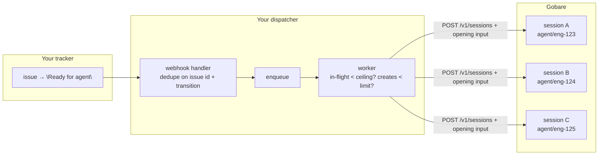
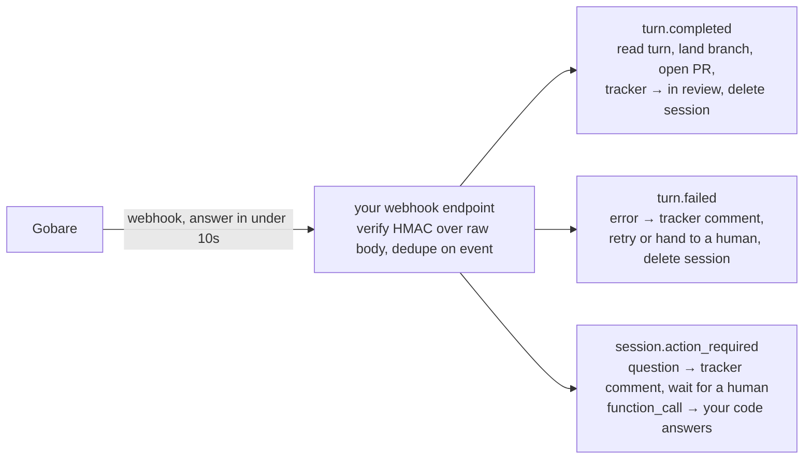

**The shape:** every ticket becomes one agent session, on one branch, in its
own machine. Sessions run concurrently against the same repository. State of
record lives in your tracker and in git — sessions are disposable. Your
backend is event-driven and never holds a connection open.

This page is for that shape specifically. If you want one long-lived agent a
person talks to, see [Let several agents work on one thing](/guides/agents-that-work-together)
instead.

Every field and limit below is checked against the published
[`openapi.json`](https://api.gobare.dev/v1/openapi.json) and verified against
production, not assumed from the spec.

## The six rules

1. **One ticket = one session = one branch.** The branch is the unit of
   isolation for *writes*; the session is the unit of isolation for
   *execution*. Never let two sessions share a branch.
2. **Sessions are disposable.** Context comes from the ticket and the repo.
   Delete the session when the PR is open. Pausing exists, but you don't
   design around it — you design around your tracker and git.
3. **Webhooks, not the event stream.** Subscribe once, handle three event
   types, and let every request return immediately. See [webhooks.md](/webhooks).
4. **Idempotency everywhere.** Your tracker re-delivers. Gobare webhooks are
   at-least-once and can arrive out of order. Every write carries an
   `Idempotency-Key`; every handler you write is safe to run twice. See
   [idempotency.md](/idempotency).
5. **Gate on the two ceilings that actually bite a fleet.** Session creation
   is rate-limited separately from everything else, and concurrent sessions
   have an organization-wide ceiling that a session holds until you delete it.
   See [limits.md](/limits). Your dispatcher owns both.
6. **A ticket must fit inside the workspace lifetime.** A workspace is
   reclaimed after a fixed amount of *active* time; paused time doesn't
   count. A turn still running past it ends `failed`. Split tickets that
   won't fit — don't discover it near the deadline.

## Architecture





There are two systems of record and Gobare is neither. Your tracker knows
*what* was asked and *where it is*. Git knows *what changed*. Gobare knows only
how to run the work.

## One-time setup

**Connect GitHub**, in the Console, before naming `environment.repo` on any
session — a request that names it before the connection exists is refused up
front.

**Save the fleet's standing rules as an agent**, so no per-ticket prompt has
to repeat them, and changing the rules is one call rather than a deploy:

```bash
AGENT=$(curl -s -X POST $GOBARE_API/v1/agents \
  -H "Authorization: Bearer $GOBARE_TOKEN" -H 'content-type: application/json' \
  -d '{
    "name": "ticket-worker",
    "model": "MiniMax-M3",
    "approval_mode": "auto",
    "instructions": "You implement one ticket per session.\nWork only on the branch named in the message; create it from the default branch if it does not exist. Never touch any other branch.\nRun the test suite before finishing.\nWhen the work is done, run: git add -A && git commit -m \"<TICKET-ID>: <summary>\" && git format-patch origin/HEAD --stdout > /workspace/outputs/changes.patch\nFinish with a short PR description: what changed, how it was tested, anything the reviewer must know.\nIf the ticket is ambiguous, stop and ask instead of guessing.",
    "text": { "verbosity": "medium" }
  }' | jq -r .id)
```

`approval_mode: "auto"` for a fleet that lands PRs — the PR *is* the approval
gate. See [saved-agents.mdx](/saved-agents) for what an agent does and does
not carry forward.

**Subscribe your webhook endpoint** to the three events this pattern needs:

```bash
curl -s -X POST $GOBARE_API/v1/webhooks \
  -H "Authorization: Bearer $GOBARE_TOKEN" -H 'content-type: application/json' \
  -d '{"url":"https://your-backend.example/gobare/events",
       "events":["turn.completed","turn.failed","session.action_required"]}'
```

The secret is in this response only — store it. Verification, the retry
schedule, and the traps that all fail looking like a bad signature are covered
once, in [webhooks.md](/webhooks); this page assumes you've read that.

## Per-ticket flow

**Tracker → dispatcher.** When an issue enters your trigger state, your
tracker's webhook handler dedupes on issue id + transition, enqueues
`{issue_id, identifier, title, description, repo}`, and returns. Do **not**
create the Gobare session inside that handler — the creation-rate ceiling and
the concurrency ceiling both need one place that knows how many are in
flight.

**Worker → gate, then create the session with its opening message.** Before
creating: count in-flight sessions — keep your own counter, or ask Gobare with
`GET /v1/sessions?created_by_token=me&limit=100` — and hold the ticket if
you're at the ceiling. The refusal for a full project **never succeeds on
retry**; only a delete frees a slot.

Then one call — the session and its first message together:

```bash
curl -s -X POST $GOBARE_API/v1/sessions \
  -H "Authorization: Bearer $GOBARE_TOKEN" \
  -H 'content-type: application/json' \
  -H "Idempotency-Key: ticket-$ISSUE_ID" \
  -d '{
    "agent": { "id": "'$AGENT'" },
    "environment": { "repo": "acme/site" },
    "title": "ENG-123",
    "metadata": {
      "issue": "ENG-123",
      "issue_id": "'$ISSUE_ID'",
      "branch": "agent/eng-123"
    },
    "input": "Issue ENG-123\n\nBranch: agent/eng-123\n\nTitle: <title>\n\nDescription:\n<description>\n\nAcceptance criteria:\n<criteria>"
  }' | jq -r .id
```

- `agent.id` inherits the saved agent; any field can still be overridden per
  session.
- `input` is all-or-nothing: if the message can't be accepted, the session
  isn't created either. Nothing to clean up on failure.
- `metadata` is yours, returned unchanged, never interpreted — put the
  tracker's own id in it so every later webhook routes back without a lookup
  table: `GET /v1/sessions?metadata=issue:ENG-123`. See
  [sessions.md](/sessions) for the field, and [pagination.md](/pagination)
  for filtering by it.
- **The branch is reported, not chosen.** The clone checks out the repo's
  default branch; the agent creates the ticket branch from it, per the
  instructions above. Sending `environment.branch` is refused — it is
  reported by the clone, not something you set.
- A `201` doesn't mean the clone happened — that happens when the workspace
  comes up. Before concluding the agent ignored the instructions, read
  `environment.repo.clone_error` on the session.

The worker moves on. Nothing is held open.

## Getting the change out of the sandbox

The sandbox clones through your GitHub connection. Whether it can also *push*
depends on what credential it holds, and the safe default is: **it holds
none.**

**Recommended — you push, from your own infrastructure.** The saved agent's
instructions above make it write
`git format-patch … > /workspace/outputs/changes.patch`. Anything under
`/workspace/outputs` is published as an artifact when the turn completes.
Your `turn.completed` handler fetches it, applies it to a fresh clone on
`agent/eng-123`, and pushes:

```bash
# in your turn.completed worker
curl -s "$GOBARE_API/v1/sessions/$SESSION/artifacts/archive?turn_id=$TURN" \
  -H "Authorization: Bearer $ARTIFACTS_TOKEN" | tar -x -C ./out
git fetch origin && git checkout -B agent/eng-123 origin/main
git am ./out/changes.patch && git push -u origin agent/eng-123
```

The sandbox never has write access to your repository, and — this matters
below — **every write to the repository now goes through one process you
control.**

**Alternative — the agent pushes.** Bind an environment profile holding a
scoped, short-lived push token. Profiles are bind-only: values can't be set or
read back through the API. Fewer moving parts, but a credential that can write
to your repo is now inside a machine running a model. Start with the
recommended path — you'll want it the moment a security review happens
anyway, and it makes the write-race answer below trivial.

## `turn.completed` → land it, open the PR, close the loop

1. Verify the signature; dedupe on `(session_id, type, created_at)`.
2. `GET /v1/sessions/{id}` for `metadata.issue`, `metadata.branch`.
3. `GET /v1/sessions/{id}/turns?limit=1` for status, final message, artifacts.
4. If artifacts are `"pending"`: re-enqueue and come back — rare, publication
   can lag by a few seconds. `"partial"` names what was dropped in
   `artifacts_skipped`.
5. Fetch `changes.patch`, apply, push `agent/eng-123` (above).
6. Open the PR: base `main`, head `agent/eng-123`, body = the agent's final
   message plus a link to the issue.
7. Tracker: move the issue to "In review", attach the PR URL.
8. `DELETE /v1/sessions/{id}`.

Step 8 is not housekeeping. A session holds one of your concurrency slots
until it's deleted, paused or not. Your state is in the PR now — kill the
box.

## `turn.failed`

1. `GET /v1/sessions/{id}/turns?limit=1` for the error.
2. Tracker: comment the error on the issue, move it to a failed state.
3. Decide: retry with a **new** session on the same branch, or route to a
   human.
4. `DELETE /v1/sessions/{id}`.

A retry starts from a clean machine and the last state you pushed — if you
pushed nothing, it starts from the ticket, which is exactly right after a
failure. Check `environment.repo.clone_error` too: a failed clone is the one
failure that isn't the agent's.

## `session.action_required`

The agent stopped and is waiting — see [required-actions.md](/required-actions)
for the full shape. For this fleet, the move that pays off: **a `question`
becomes a comment on the ticket.** Post the agent's question, move the issue
to a waiting state. When a human replies, send `input.question_answer` with
the reply and the turn resumes. The sandbox paused while it waited and cost
nothing — paused time doesn't count against the workspace lifetime, and
nothing times a required action out.

The ticket is the conversation. The agent never talks to anyone directly.

## The write-race question, answered

> How do you handle multiple instances of the same agent racing on writes?

**Gobare doesn't, and shouldn't.** Sessions are isolated machines; nothing
races *inside* the runtime. The race is at the destination — your
repository — and that is your consistency model to own. Git is already good
at this; the pattern above just uses it:

- **One session per branch.** Two sessions never write the same ref.
- **One pusher.** With the recommended path above, every push comes from your
  `turn.completed` worker. Serialise that worker per repository and there is
  no race left to have.
- **Merge is where conflicts surface** — at PR time, in front of a reviewer or
  a merge queue. Visible, reversible, already tooled.
- **Retry = new session, same branch.** No half-written workspace to reason
  about.
- **Two tickets touching the same files** is a tracker problem, not a runtime
  one. Your dispatcher can see every in-flight session
  (`?created_by_token=me`) with its branch in `metadata`; hold a ticket whose
  paths overlap one already running.

What Gobare gives you to build that: each session is separately addressable,
carries your labels, and is listable and filterable. Orchestration stays on
your side, on purpose.

## Idempotency, concretely

| Where | Key | Why |
| --- | --- | --- |
| `POST /v1/sessions` | `ticket-{issue_id}` | Your tracker re-delivers; two sessions for one ticket is two branches fighting each other |
| answers to required actions | `answer-{call_id}` | Your tracker's own webhook can fire twice for one comment |
| your Gobare webhook handler | `(session_id, type, created_at)` | At-least-once, possibly out of order |
| the PR-open step | branch name | A retried `turn.completed` must not open two PRs |

`turn_id` and `call_id` are copied from the required action, and `output` for
a tool result must be a **string** — serialise JSON yourself. Never send a
thrown exception's message as `error`; it reaches the model.

## A crew, if you go there

`parent_session_id` on create joins sessions into a tree;
`GET /v1/sessions?root=` and `GET /v1/events?root=` address the whole tree at
once — see [Crews](/sessions#crews). For tickets running in parallel you
don't need it, but if one ticket ever fans out into its own reviewer session,
that's the primitive. See
[Let several agents work on one thing](/guides/agents-that-work-together).

## What this doesn't cover

- **Cross-ticket dependencies** (B needs A's branch). Sequence them in your
  dispatcher.
- **A shared build cache across sessions.** Not first-class today.
- **Cost per ticket.** The shape is compute-time, not tokens — model spend
  stays with your provider. See [limits.md](/limits) for what the sandbox
  itself costs against.

## Next

- [sessions.md](/sessions) — every field `POST /v1/sessions` accepts
- [webhooks.md](/webhooks) — verification, retry schedule, the traps
- [limits.md](/limits) — the two ceilings this fleet gates on, with the numbers
- [idempotency.md](/idempotency) — the key, scoped precisely
- [required-actions.md](/required-actions) — answering what an agent asks
