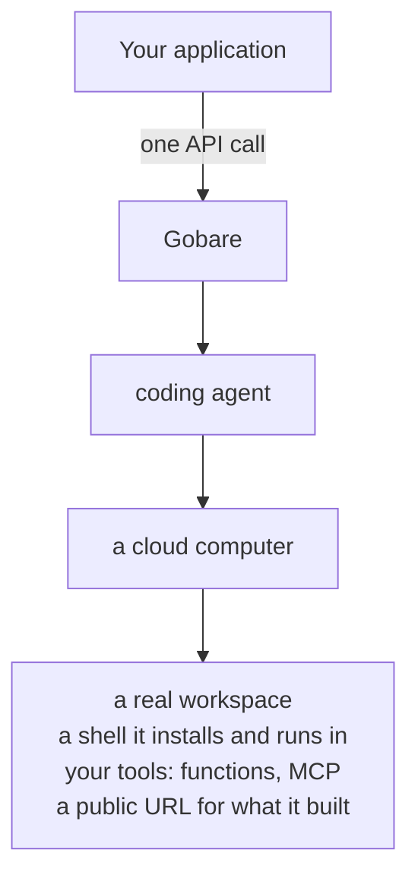
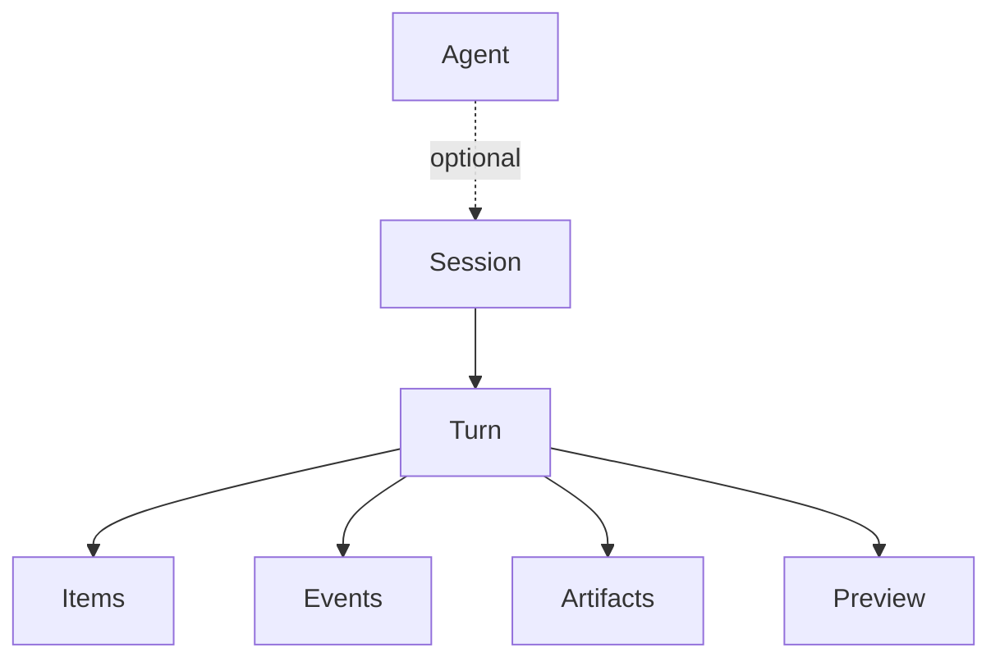

**Run a coding agent from your own code.** Not a model that writes code back to
you — an agent with a computer, that writes files, runs them, and leaves what it
built at a URL you can open.



**You bring the model key.** Gobare does not sell you inference — it runs an
agent against a connection your organization owns, on a sandbox Gobare provides.
You pay your model provider for tokens and Gobare for the computer.

## A minute, start to finish

This asks for something to be built, waits, and prints an address. Nothing is
elided — it is the whole program.

<CodeGroup>

```bash curl
SESSION=$(curl -s -X POST https://api.gobare.dev/v1/sessions \
  -H "Authorization: Bearer $GOBARE_TOKEN" -H 'content-type: application/json' \
  -d '{"agent":{"model":"MiniMax-M3"},
       "input":"Build a small expense tracker web page — a form to add an expense, a running total, saved in localStorage. Serve it on port 8000 and keep the server running."}' \
  | jq -r .id)

# The turn appears a moment after the session, so the list is briefly empty —
# and an empty list means it has not started, not that it has finished.
until [ "$(curl -s "https://api.gobare.dev/v1/sessions/$SESSION/turns?limit=1" \
  -H "Authorization: Bearer $GOBARE_TOKEN" | jq -r '.data[0].status // "working"')" != "working" ]; do sleep 5; done

curl -s -X POST "https://api.gobare.dev/v1/sessions/$SESSION/preview" \
  -H "Authorization: Bearer $GOBARE_TOKEN" -H 'content-type: application/json' -d '{}' | jq -r .url
```

```typescript TypeScript
const API = "https://api.gobare.dev";
const AUTH = { Authorization: `Bearer ${process.env.GOBARE_TOKEN}`, "content-type": "application/json" };

const call = async (method: string, path: string, body?: unknown) =>
  (await fetch(API + "/v1" + path, { method, headers: AUTH, body: body && JSON.stringify(body) })).json();

const session = await call("POST", "/sessions", {
  agent: { model: "MiniMax-M3" },
  input: "Build a small expense tracker web page — a form to add an expense, a running " +
         "total, saved in localStorage. Serve it on port 8000 and keep the server running.",
});

for (;;) {
  const [turn] = (await call("GET", `/sessions/${session.id}/turns?limit=1`)).data;
  if (turn && turn.status !== "working") break;
  await new Promise((resolve) => setTimeout(resolve, 5000));
}

console.log((await call("POST", `/sessions/${session.id}/preview`, {})).url);
```

```python Python
import json, os, time, urllib.request

API, TOKEN = "https://api.gobare.dev", os.environ["GOBARE_TOKEN"]
AUTH = {"Authorization": "Bearer " + TOKEN, "content-type": "application/json"}

def call(method, path, body=None):
    return json.load(urllib.request.urlopen(urllib.request.Request(
        API + "/v1" + path, data=json.dumps(body).encode() if body is not None else None,
        headers=AUTH, method=method)))

session = call("POST", "/sessions", {
    "agent": {"model": "MiniMax-M3"},
    "input": "Build a small expense tracker web page — a form to add an expense, a running "
             "total, saved in localStorage. Serve it on port 8000 and keep the server running.",
})

while True:
    turns = call("GET", f"/sessions/{session['id']}/turns?limit=1")["data"]
    if turns and turns[0]["status"] != "working":
        break
    time.sleep(5)

print(call("POST", f"/sessions/{session['id']}/preview", {})["url"])
```

</CodeGroup>

```
https://s-a23a2eb878db4d8bbefd.gobare.dev
```

Open it. There is a working page there, served from the computer the agent was
given — a form, a running total, saved in the browser. **Forty-nine seconds on
one run of this, a hundred and eleven on another**; the difference is how long
the sandbox took to come up.

You need a token for this. It takes a minute and the
[quickstart](/quickstart) has it.

## What just happened

Five nouns, and they nest:



- **Agent** — a named configuration: model, instructions, tools. Optional; a
  session can carry its own.
- **Session** — one cloud computer. Its workspace persists between rounds and
  survives being paused.
- **Turn** — one piece of work, from your message until it settles.
- **Items** — the record: messages, tool calls, file changes.
- **Events** — the same, as it happens: streamable, resumable.
- **Artifacts** — files it published; they outlive the computer.
- **Preview** — a port it serves, optionally at a public URL.

The session is the thing to hold on to. Everything else is reached through it,
and a session you created yesterday still answers today — its computer may have
been reclaimed and rebuilt, and the conversation does not restart.

## Why this and not a model API

A model API returns text. You would still be writing the part that actually
runs: a sandbox and its lifecycle, an agent loop, tool dispatch, file capture,
streaming, resumption after a dropped connection, and somewhere for a person to
approve something before it happens.

That list is the product. It is also why there is
[no sandbox-free mode](/design-decisions) — for a coding agent the workspace
is not an accessory.

What Gobare deliberately does **not** do: sell you inference, choose your model,
or hold your conversation state in your process. The first is why you connect
your own key; the last is why a session is a URL you can come back to rather
than an object you keep in memory.

Coming from another Agents API? [design-decisions.md](/design-decisions) lists
where this one diverges and why — queueing versus steering, durable versus
transient events, and what `completed` does not mean.

## Common tasks

| | |
| --- | --- |
| **Run one task and collect the result** | [quickstart.md](/quickstart) |
| **Put it in a service and keep it running** | [production-integration.md](/production-integration) |
| **Call it from TypeScript, with types** | [typescript.md](/typescript) |
| **Call it from Python, with types** | [python.md](/python) |
| **Let the agent call your own code** | [required-actions.md](/required-actions) |
| **Be told when it finishes, rather than waiting** | [webhooks.md](/webhooks) |
| **Put what it built on a public URL** | [preview.md](/preview) |
| **Look up a field or an endpoint** | [objects.md](/objects) · [reference.md](/api-reference/check-the-access-token) |
| **Work out why something looks wrong** | [troubleshooting.md](/troubleshooting) |

Base URL: `https://api.gobare.dev` — `https://app.gobare.dev` serves the same
API and is what the Console uses.

## Every page

| Page | Read it when |
| --- | --- |
| [quickstart.md](/quickstart) | First time. Token to completed turn, in one page |
| [production-integration.md](/production-integration) | It works, and now it has to keep working |
| [typescript.md](/typescript) | You are past `curl` and putting this in a service |
| [python.md](/python) | The same, in Python |
| [AGENTS.md](/AGENTS) | The client is an agent. The whole build order in one pass, with a check after every step and a self-test at the end |
| [model-credentials.md](/model-credentials) | You want to connect a model without opening the Console |
| [sessions.md](/sessions) | You want a session to hold your repo, files, secrets or limits |
| [saved-agents.md](/saved-agents) | You want every session in one part of your product to start the same way |
| [input.md](/input) | You want to send the agent a message, a result, a steer or a stop |
| [events.md](/events) | You want to watch a session instead of polling it |
| [webhooks.md](/webhooks) | You want to be told rather than to watch |
| [preview.md](/preview) | You want what the agent built to be reachable by other people |
| [tools.md](/tools) | You want to give the agent your functions, or an MCP server |
| [required-actions.md](/required-actions) | You want the agent to call *your* code |
| [idempotency.md](/idempotency) | Your caller retries, and you need it not to act twice |
| [pagination.md](/pagination) | A collection has more rows than one page, or you need to find a session by your own id |
| [troubleshooting.md](/troubleshooting) | Something looks wrong and you want it by symptom, not by endpoint |
| [errors.md](/errors) | Something returned a code you have not seen |
| [limits.md](/limits) | You are planning load, or you got a 429 |
| [changelog.md](/changelog) | You want to know what changed, and when |
| [design-decisions.md](/design-decisions) | You want to know why the API behaves as it does |

Those pages describe the parts. [Guides](/guides) put them together:
six scenarios — long-running work, structured extraction, approvals, dispatch
from your own service, showing the agent's work live, and moving between model
providers — each written as a sequence you can copy.

The machine-readable reference is `GET /v1/openapi.json` — OpenAPI 3.1, **no
token needed**, because it describes the API rather than holding data in it.
Take it before you read anything else here: it carries every field constraint
and a real example payload for every event type, which is the part prose is
worst at. Every `/v1` response points at it:

```
link: </v1/openapi.json>; rel="service-desc"; type="application/json"
```

That is there for callers who cannot read this page — an agent has the response
in front of it and no way to guess a URL, and one header on a call it was
already making is worth more than a paragraph it will never see. It is generated from the same route table the server matches against, so it
cannot describe an endpoint that does not exist.

## How these pages stay true

The product repository is the source. This directory is checked against the
code it describes — ceilings against the constants that enforce them, error
codes against their statuses, both event vocabularies — so a page cannot
quietly drift from the API.

These pages are published as a site at
[docs.gobare.dev](https://docs.gobare.dev), built from this directory by
`deploy/publish-docs-site.sh`. A copy of the markdown also goes to
[gobare_tools](https://github.com/MishaBear94/gobare_tools/tree/main/docs/api)
via `scripts/publish-api-docs.sh`, which refuses to run if the check above does
not pass.

## Scope

Gobare brings your own model key. The API does not sell you inference — it runs
an agent against a model credential your organization has already connected, on
a sandbox Gobare provides. There is no request field for a model provider,
because the provider is a property of the credential.

There is also no sandbox-free mode. For a coding agent the workspace is the
product, not an accessory, so every session has one.
